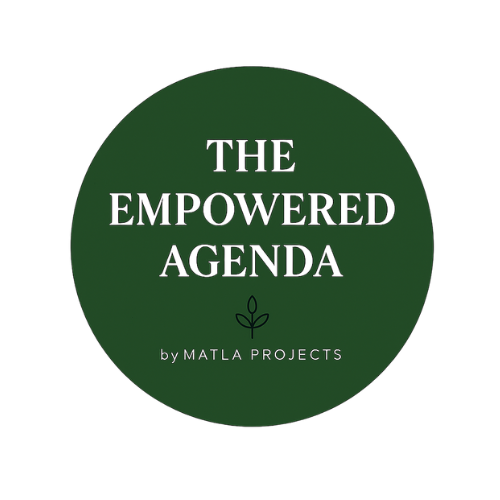

  
  <h2 style="margin:0; font-family:'Playfair Display', serif;">The Empowered Agenda</h2>
  

    Where intention meets excellence
  

Welcome to The Empowered Agenda—a coaching platform designed to inspire women to lead with clarity, grow with purpose, and thrive holistically. Whether you're navigating corporate leadership, building a business, or seeking a more intentional life, this space offers tools to support your journey.

  <h3 style="text-align:center; font-family:'Playfair Display', serif;">🪞 Weekly Reflection Journal</h3>
  
This guided space invites you to pause, reflect, and realign with your goals. Use it to explore your wins, challenges, and intentions for the week ahead.

  
  <ul style="list-style-type: none; padding-left: 0;">
    <li>🌸 What energized me this week?</li>
    <li>🌿 What felt misaligned or draining?</li>
    <li>✨ What intention will I carry forward?</li>
  </ul>

  
Download the printable journal <a href="https://www.canva.com/design/DAG07EX2abg/pswykhNDoHUUHc4zCKUC7w/edit?ui=e30" style="color:#8A9A5B;">here</a>.

---

  <h3 style="text-align:center; font-family:'Playfair Display', serif;">🎯 Strategic Goal Planner</h3>
  
Use this SMART framework to set goals that are meaningful, achievable, and aligned with your deeper intentions.

  <ul style="list-style-type: none; padding-left: 0;">
    <li>✅ Specific: What exactly do I want to achieve?</li>
    <li>📏 Measurable: How will I track progress?</li>
    <li>🎯 Achievable: Is this realistic given my resources?</li>
    <li>⏳ Relevant: Does this align with my values and priorities?</li>
    <li>📆 Time-bound: What’s my timeline?</li>
  </ul>

  
Download the printable planner <a href="https://www.canva.com/design/DAG07EX2abg/pswykhNDoHUUHc4zCKUC7w/edit?ui=e30" style="color:#333;">here</a>.

## 🧰 Explore Coaching Resources

- [🪞 Weekly Reflection Journal](templates/weekly-reflection.md)  
  A guided space to pause, reflect, and realign with your goals.

- [🎯 Strategic Goal Planner](templates/goal-planner.md)  
  A SMART framework to help you set meaningful, achievable goals.

- [✅ Action Plan Checklist](templates/action-checklist.md)  
  Break down your goals into clear, doable steps.

---

## 🎨 Brand Identity

| Element        | Description                                      |
|----------------|--------------------------------------------------|
| **Colors**     | Blush `#F4D7D7`, Sage `#C2D1C1`, Beige `#F5F1E9`, Muted Olive `#8A9A5B`, Charcoal `#333333`  
| **Fonts**      | Playfair Display (titles), Montserrat (body), Open Sans (tables)  
| **Visuals**    | Rounded journaling boxes, soft dividers, minimalist icons  
| **Tone**       | Empowering, warm, strategic, clear  

---

## ✨ About the Creator

Lucinda is a workplace leader and coach with deep experience in HR, operations, and wellness. She blends compliance with compassion to help women rise—at work and in life. Her coaching style is strategic, soulful, and rooted in clarity.

---

> “Small steps lead to empowered outcomes.”  
Let’s rise together.

  
<strong>Let’s rise together.</strong>

  
Connect with Lucinda · <a href="mailto:lucinda@example.com" style="color:#8A9A5B;">Email</a> · <a href="https://www.linkedin.com/in/lucinda" style="color:#8A9A5B;">LinkedIn</a>

  
© 2025 The Empowered Agenda

